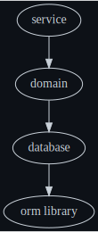

# Object Relational Mapping

Typical orm dependency structure



My orm dependency structure


I never let my service layer become aware of database keys.
The only reason I used database keys is at the database layer to perform joins or lookups.
My intention is to protect the abstraction boundary between the service and the database.

service module
```kotlin
data class RefreshToken(val userName: String)
data class AccessToken(val userName: String, val role: Role)
data class Tokens(val refreshToken: RefreshToken, val accessToken: AccessToken)
data class ElectionDetail(
    val ownerName: String,
    val electionName: String,
    val candidateCount: Int,
    val voterCount:Int,
    val secretBallot: Boolean = true,
    val noVotingBefore: Instant? = null,
    val noVotingAfter: Instant? = null,
    val allowEdit: Boolean = true,
    val allowVote: Boolean = false,
)
interface Service {
    fun register(userName: String, email: String, password: String): Tokens
    fun setRole(accessToken: AccessToken, userName: String, role: Role)
    fun addElection(accessToken: AccessToken, userName:String, electionName: String)
    fun getElection(accessToken: AccessToken, electionName: String): ElectionDetail
    fun setCandidates(accessToken: AccessToken, electionName: String, candidateNames: List<String>)
}
```

The service delegates to the database to modify the database

Implementation of addElection, in the service module
```kotlin
    override fun addElection(accessToken: AccessToken, userName:String, electionName: String) {
        requirePermission(accessToken, USE_APPLICATION)
        val validElectionName = validateElectionName(electionName)
        requireElectionNameDoesNotExist(electionName)
        mutableDbCommands.addElection(accessToken.userName, userName, validElectionName)
    }
```

The contract of the database does not even expose database ids.
Also, the service is not just a 1:1 pass-through to the database.
The service often calls many database commands, or composes many database queries.

database module
```kotlin
interface MutableDbCommands {
    fun createUser(
        authority: String,
        userName: String,
        email: String,
        salt: String,
        hash: String,
        role: Role
    )
    fun setRole(authority: String, userName: String, role: Role)
    fun addElection(authority: String, owner: String, electionName: String)
    fun addCandidates(authority: String, electionName: String, candidateNames: List<String>)
    fun removeCandidates(authority: String, electionName: String, candidateNames: List<String>)
}
```

If we follow addElection down to the database implementation,
we see all we are doing in kotlin code is choosing the name of the query,
and the order of the parameters.
We still have not exposed the fact that we are using a relational database or sql.

database module
```kotlin
class MutableDbCommandsImpl(
    genericDatabase: GenericDatabase
) : MutableDbCommands, GenericDatabase by genericDatabase {
    override fun addElection(authority: String, owner: String, electionName: String) {
        update("election-insert", owner, electionName)
    }
}
```

We finally get to library that handles object relational mapping.
It is at this point that we start talking to JDBC.

genericdb (orm module)
```kotlin
class QueryLoaderFromResource : QueryLoader {
  override fun load(name: String): String {
    val resourceName = "com/seanshubin/condorcet/backend/database/$name.sql"
    val charset = StandardCharsets.UTF_8
    val classLoader = this.javaClass.classLoader
    val inputStream = classLoader.getResourceAsStream(resourceName)
    if (inputStream == null) {
      throw RuntimeException("Resource named '$resourceName' not found")
    } else {
      return inputStream.consumeString(charset)
    }
  }
}
class ConnectionWrapper(
  private val connection: Connection,
  private val sqlEvent: (String) -> Unit,
  private val sqlException: (String, String, SQLException) -> Unit
) : AutoCloseable {
  fun update(name: String, code: String, vararg parameters: Any?): Int {
    val statement = connection.prepareStatement(code) as ClientPreparedStatement
    updateParameters(name, parameters, statement)
    return statement.use {
      executeUpdate(name, statement)
    }
  }

  private fun updateParameters(name: String, parameters: Array<out Any?>, statement: ClientPreparedStatement) {
    try {
      parameters.toList().forEachIndexed { index, any ->
        val position = index + 1
        if (any == null) {
          statement.setObject(position, null)
        } else when (any) {
          is String -> statement.setString(position, any)
          is Boolean -> statement.setBoolean(position, any)
          is Int -> statement.setInt(position, any)
          is Instant -> statement.setTimestamp(position, Timestamp.from(any))
          else -> throw UnsupportedOperationException("Unsupported type ${any.javaClass.simpleName}")
        }
      }
    } catch (ex: SQLException) {
      throw SQLException("$name\n${statement.asSql()}\n${ex.message}", ex)
    }
  }

  private fun executeUpdate(name: String, statement: PreparedStatement): Int {
    try {
      sqlEvent(statement.asSql())
      return statement.executeUpdate()
    } catch (ex: SQLException) {
      sqlException(name, statement.asSql(), ex)
      throw SQLException("$name\n${statement.asSql()}\n${ex.message}", ex)
    }
  }

  private fun Statement.asSql(): String = (this as ClientPreparedStatement).asSql()
}
class GenericDatabaseImpl(
    private val connection: ConnectionWrapper,
    private val queryLoader: QueryLoader
) : GenericDatabase {
    override fun update(name: String, vararg parameters: Any?): Int {
        val code = queryLoader.load(name)
        return connection.update(name, code, *parameters)
    }
}
```

Finally, the sql statements are not sitting in kotlin files, they are in .sql files.
This allows us to connect our Integrated Development Environment to the database,
so we have autocomplete and syntax highlighting while we write our queries,
as well as being warned when we mistype a column name.

election-insert.sql
```sql
insert into election (owner_id, name)
values ((select id from user where name = ?), ?)
```

All of our sql statements can be found in the [database](../database/src/main/resources/com/seanshubin/condorcet/backend/database/) module
Since our sql is isolated, we can write an integration test for each one.
You can usually get away with only a single integration test per query.
It is a matter of setting up the data such that each bit of conditional logic can be tested by the existence or nonexistence of a row.

The genericdb (orm module), that only has to be written once, can be tested by stubbing out resultsets.

The database module, which is aware of the domain, can be fully unit tested without any knowledge of JDBC.

Now let's have a look at queries

The service delegates to the database to query the database.

Implementation of getElection, in the service module
```kotlin
override fun getElection(accessToken: AccessToken, electionName: String): ElectionDetail {
    requirePermission(accessToken, VIEW_APPLICATION)
    val election = findElection(electionName)
    val candidateCount = mutableDbQueries.candidateCount(electionName)
    val voterCount = mutableDbQueries.voterCount(electionName)
    val electionDetail = election.toElectionDetail(candidateCount, voterCount)
    return electionDetail
}
```

Notice that the service executes 3 queries.
I could have also made a single query for this api call,
as I am not locked in to a 1:1 mapping between service calls and database calls.

database module
```kotlin
interface MutableDbQueries : GenericDatabase {
    fun searchElectionByName(name: String): ElectionSummary?
    fun candidateCount(electionName:String):Int
    fun voterCount(electionName:String):Int
}
```

If we follow searchElectionByName down to the database implementation,
we see all we are doing in kotlin code is choosing the name of the query,
and the order of the parameters.
Notice that in candidateCount we use the election name rather than the election id,
so still have not exposed the fact that we are using a relational database or sql.

For queries, I just write a mapping function from a ResultSet to a domain object.
These functions usually only look at the current row of the ResultSet,
and also handle any needed type conversions,
such as from a java.sql.Timestamp to an java.time.Instant

This way the orm code can remain generic,
don't need to specify domain data types.

database module
```kotlin
class MutableDbQueriesImpl(genericDatabase: GenericDatabase) : MutableDbQueries,
    GenericDatabase by genericDatabase {

    override fun searchElectionByName(name: String): ElectionSummary? =
        queryZeroOrOneRow(::createElectionSummary, "election-select-by-name", name)

    override fun electionCount(): Int =
        queryExactlyOneInt("election-count")

    override fun candidateCount(electionName: String): Int =
        queryExactlyOneInt("candidate-count-by-election", electionName)

    private fun createElectionSummary(resultSet: ResultSet): ElectionSummary {
        val owner = resultSet.getString("owner")
        val name: String = resultSet.getString("name")
        val secretBallot: Boolean = resultSet.getBoolean("secret_ballot")
        val noVotingBefore: Instant? = resultSet.getTimestamp("no_voting_before")?.toInstant()
        val noVotingAfter: Instant? = resultSet.getTimestamp("no_voting_after")?.toInstant()
        val allowEdit: Boolean = resultSet.getBoolean("allow_edit")
        val allowVote: Boolean = resultSet.getBoolean("allow_vote")
        return ElectionSummary(
            owner, name, secretBallot, noVotingBefore, noVotingAfter, allowEdit, allowVote
        )
    }
}
```
By the time we start talking to JDBC,
the data types are generic,
so from here we are not coupled to the domain.

genericdb (orm module)
```kotlin
class ConnectionWrapper(
  private val connection: Connection,
  private val sqlEvent: (String) -> Unit,
  private val sqlException: (String, String, SQLException) -> Unit
) : AutoCloseable {
    fun <T> queryZeroOrOneRow(name: String, code: String, vararg parameters: Any?, f: (ResultSet) -> T): T? =
        query(name, code, *parameters) { resultSet ->
            if (resultSet.next()) {
                val result = f(resultSet)
                if (resultSet.next()) {
                    throw RuntimeException("No more than 1 row expected for '$name'\n$code")
                }
                result
            } else {
                null
            }
        }
}
class GenericDatabaseImpl(
    private val connection: ConnectionWrapper,
    private val queryLoader: QueryLoader
) : GenericDatabase {

    override fun <T> queryZeroOrOneRow(
        createFunction: (ResultSet) -> T,
        name: String,
        vararg parameters: Any?
    ): T? {
        val code = queryLoader.load(name)
        return connection.queryZeroOrOneRow(name, code, *parameters) { createFunction(it) }
    }

    override fun queryExactlyOneInt(name: String, vararg parameters: Any?): Int =
        queryExactlyOneRow(::createInt, name, *parameters)

    private fun createInt(resultSet: ResultSet): Int = resultSet.getInt(1)
}
```

Here are sql statements backing the getElection feature

election-insert.sql
```sql
insert into election (owner_id, name)
values ((select id from user where name = ?), ?)
```

What about query caching?

A lot of times you can eliminate the need for this by arranging your code so you are not making repetitive calls to the database.
This is harder to do if your queries are dynamically generated by something you don't control.
I value libraries that solve problems I would have had without them.
Library solutions to problems they created do not impress me.

